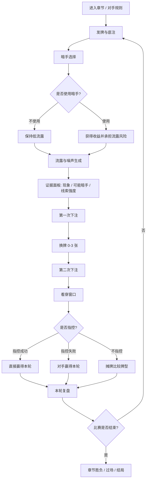

# 信使 — The Courier (Web Demo)

一个关于赌博、修辞与一封信的星际旅程。

## 游戏机制概览

《信使》的核心不是单纯比牌，而是围绕“暗手”和“流露”的信息博弈：玩家与对手都可以在牌局中使用暗手改变局势，但暗手会留下可被观察到的流露线索。玩家需要在牌力、风险、下注压力、证据可信度和指控代价之间做判断。

每轮牌局由六个关键决策点组成：

1. **发牌**：双方各获得 5 张手牌，并支付底注进入彩池。
2. **暗手选择**：玩家可选择不出暗手，或使用偷看、偷换、伪装、烟雾、拨牌、记牌等暗手。
3. **流露观察**：系统根据双方暗手生成真实线索，并混入角色噪声；玩家看到的是“证据”，不是确定答案。
4. **下注与换牌**：玩家根据牌力、流露风险和对手破绽决定过牌、跟注、加注、弃牌，以及换 0-3 张牌。
5. **看穿窗口**：第二次下注后，玩家可以根据证据指控对手具体使用了哪种暗手；指控成功直接赢得本轮，指控失败则被对手反利用。
6. **回合复盘**：回合结束后展示本轮暗手、证据数量、结算结果和关键因果，帮助玩家理解胜负来源。

### 核心循环



### 对手与章节定位

- **灯塔守人 / 沉钟星**：教学型对手。下注保守、破绽明显、几乎不会指控玩家，适合熟悉暗手与流露。
- **演员卢卡 / 镜面剧场**：变化型对手。每两轮切换面具，不同面具对应不同暗手偏好、下注风格和指控阈值。
- **无名邮差 / 终点星**：镜像型对手。会参考玩家此前的暗手使用历史，并周期性触发反向流露。

### 反馈设计

当前 Demo 特意强化了“玩家看得懂的博弈反馈”：

- 暗手按钮显示收益、风险和适用场景。
- 流露区显示证据现象、可能关联暗手和线索强度。
- 下注阶段显示基于牌力、双方流露和证据数量的提示。
- 指控弹窗显示当前证据摘要、指控成功/失败后果和每种暗手描述。
- 回合结束展示“本轮复盘”，解释本轮胜负的关键因果。

### 结局结构

Demo 采用三段式旅程：沉钟星 -> 镜面剧场 -> 终点星。终局根据最终胜负与玩家是否全程使用暗手进入不同结局：

- **结局 A**：玩家赢下终局，且过程中使用过暗手。
- **结局 B**：玩家在终点星输给无名邮差。
- **结局 C**：玩家赢下终局，且全程未使用任何暗手。

## 如何运行

无需安装任何依赖。推荐用任意项目级静态文件服务器打开 `index.html`：

- **推荐**：在项目根目录启动 VS Code Live Server，或运行 `python -m http.server 8000` 后访问 `http://localhost:8000/`。
- **可尝试**：双击 `index.html` 用浏览器打开；如果浏览器拦截本地 ES Modules 或 `fetch()` 读取 JSON，请改用上面的静态服务器方式。

## 项目结构

```
/
├── index.html              # 入口页面
├── IMPLEMENTATION_NOTES.md # 实现决策记录
├── README.md               # 本文件
├── .nojekyll               # GitHub Pages 配置
├── css/
│   ├── theme.css           # 调色板、字体、基础样式
│   └── main.css            # 布局、组件、响应式
├── js/
│   ├── main.js             # 启动入口与游戏控制器
│   ├── engine/
│   │   ├── deck.js         # 牌堆与发牌
│   │   ├── handEvaluator.js# 五张换牌扑克牌型判定
│   │   ├── cheats.js       # 暗手系统
│   │   ├── tells.js        # 流露与噪声生成
│   │   ├── betting.js      # 下注逻辑
│   │   └── matchState.js   # 比赛状态机
│   ├── ai/
│   │   ├── opponent.js     # AI 基类
│   │   ├── lighthouseKeeper.js
│   │   ├── luca.js
│   │   └── namelessCourier.js
│   └── ui/
│       └── renderer.js     # DOM 渲染与交互
└── data/
    ├── balance.json        # 数值平衡参数
    ├── cheats.json         # 暗手定义
    ├── characters.json     # 对手配置
    ├── dialogue.json       # 台词与剧情文本
    └── tells.json          # 流露与噪声池
```

## 调试

在浏览器控制台输入 `DEBUG` 可访问：
- `DEBUG.controller` — 游戏控制器
- `DEBUG.state` — 当前公共状态快照
- `DEBUG.forceState(stateName)` — 强制切换状态（用于测试）

## GitHub Pages 部署

项目是纯静态站点，不需要构建步骤：

1. 将仓库推送到 GitHub。
2. 在仓库 `Settings -> Pages` 中选择 `Deploy from a branch`。
3. Source 选择 `main` 分支和 `/root` 目录。
4. 等待 Pages 部署完成后访问生成的站点地址。

注意：项目内脚本、样式和数据都使用相对路径，适合部署在 `username.github.io/repo/` 这样的子路径下。

## 技术栈

- 纯 HTML5 + CSS3 + Vanilla JavaScript (ES Modules)
- 无构建步骤，无 npm 依赖
- 所有路径为相对路径
